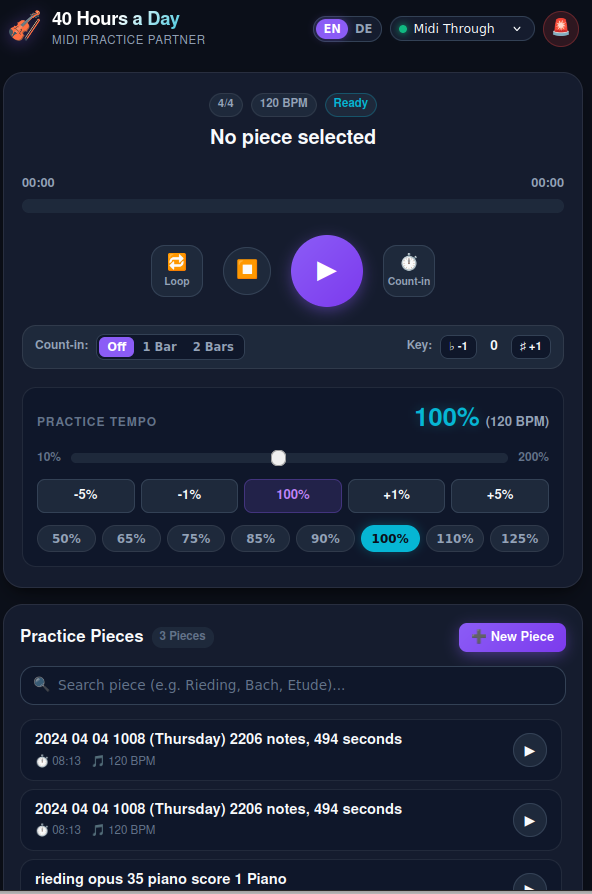

# 🎻 40 Hours a Day — MIDI Practice Partner

A modern, mobile-first MIDI practice assistant for musicians (violin, piano, etc.) designed to play accompaniment pieces directly to ALSA/Pianoteq or any MIDI sound generator on your local machine or network server.

Optimized for smartphones on music stands: quick piece selection, touch-friendly UI, real-time dynamic tempo scaling (10% – 200%), loop mode, metronome count-in, and ALSA MIDI output device selection.

<p align="center">
  
</p>

---

## 🇬🇧 English Documentation

### ✨ Features

- 📱 **Mobile-First Web UI**: Tailored for smartphone screens on a music stand or piano desk (large touch buttons, high-contrast dark theme).
- 🌍 **Multilingual (EN / DE)**: Quick language toggle in the header, automatic browser locale detection, and persistent preference.
- 🎚 **Real-time Tempo Adjustment (10% – 200%)**:
  - Continuous slider showing current percentage and effective BPM.
  - Fine-tuning stepper buttons (`-5%`, `-1%`, `100% Reset`, `+1%`, `+5%`).
  - Quick preset buttons (`50%`, `65%`, `75%`, `85%`, `90%`, `100%`, `110%`, `125%`).
  - Live updates without interrupting playback.
- ⏱ **Metronome Count-In (Lead-in)**: Selectable (`Off`, `1 Bar`, `2 Bars`). Plays woodblock click beats matching the piece's time signature and tempo so you have time to set your bow and start right on beat 1.
- 🥁 **Live Bar & Beat Counter**: Large bar / beat readout that flashes on every beat and accents the strong ones — the downbeat, the third beat of a 4/4 bar, the fourth eighth of a 6/8 bar. It runs off an exact timeline built from the file's own tempo and time-signature changes, so it stays locked to the music through an accelerando or a ritardando instead of drifting at an assumed fixed tempo. Pickup bars (Auftakt) are detected and left unnumbered, so bar 1 is the first full measure, as in the printed score.
- 🎼 **Meter Controls**: Override the time signature (`4/4`, `3/4`, `2/4`, `6/8`) when a file's header is wrong, change the beat sub-division (`½×`, `1×`, `2×`), nudge the barlines a beat at a time (`◀` `▶`) for files whose bar 1 does not begin at tick 0, switch how a pickup is numbered (`A:0` / `A:1`), and reset to whatever the file itself claims (`⟲`).
- 🔁 **Loop Mode**: Seamless repeat for practicing difficult musical passages.
- ⏩ **Interactive Scrubber**: Seek forward and backward to any section in the piece.
- ♯♭ **Pitch Transpose**: Transpose pitch up or down in semitone steps.
- 🎹 **MIDI Device / ALSA Port Selector**: Automatically detects all available ALSA output ports (`Midi Through`, `Pianoteq STAGE`, `USB Midi Cable`, etc.).
- 🚨 **MIDI Panic Button**: Instantly sends *All-Notes-Off* (CC 123), *All-Sound-Off* (CC 120), and releases sustain pedals (CC 64) across all 16 channels to kill any stuck notes.
- 📁 **MIDI File Library & Browser Upload**:
  - Scans `midi_files/` next to the app and `~/Music`, three directory levels deep. Add more with `-d/--midi-dir`, which can be repeated.
  - Metadata is cached; `--lazy` skips parsing durations and tempi until a piece is played, which matters on a slow box with a large library.
  - Search and filter by piece name / composer.
  - Upload new MIDI files directly from your phone's browser (`+ New Piece`).
- ⚡ **Zero-Framework Backend**: Pure Python standard library HTTP server with Server-Sent Events (SSE) for 10Hz smooth timeline updates. Requires only `mido` and `python-rtmidi`.

---

### 🌐 Accessing the Web App

- **Locally on the machine:**
  👉 **[http://localhost:8090](http://localhost:8090)**
- **From your smartphone or other devices on the same local network:**
  👉 **`http://<your-device-ip-or-hostname>:8090`**

---

### 🛠 Systemd Service Management (Optional Linux Service)

To run the application continuously as a user-level `systemd` background service:

```bash
# Check service status
systemctl --user status 40hoursaday.service

# Restart service
systemctl --user restart 40hoursaday.service

# Follow live service logs
journalctl --user -u 40hoursaday.service -f
```

---

### 🚀 Running Locally & Deploying

#### 1. Run locally
```bash
python3 app.py --port 8090
```

#### 2. Deploy to a remote server / Raspberry Pi
```bash
./deploy.sh <user@host-or-ip>
```

---

### 🎼 Bar & Beat Accuracy

Two command-line tools sit alongside the player. Both drive the *same* timeline
code the app uses, so what they report is what the app will count.

#### `test_bar_player.py` — check that a file's bars are right

```bash
# score timing, downbeat alignment, phantom bars and bar numbering
python3 test_bar_player.py check --dir ~/Music
python3 test_bar_player.py check piece.mid --deep    # also try other meters/offsets

# play a file and print each bar as it starts, to hear whether the count lands
python3 test_bar_player.py play piece.mid -m 3/4 --offset 1.5

# rank meters and barline offsets against the notes
python3 test_bar_player.py suggest piece.mid
```

A low downbeat score on its own does not mean the count is wrong — syncopated
music leaves downbeats empty on purpose. `suggest` tells you whether some *other*
grid explains the notes better, which is what points at a wrong header.

#### `score_repair.py` — restore bars in rendered performance MIDIs

Expressive performance renderers such as
[VirtuosoNet](https://github.com/jdasam/virtuosoNet) read a MusicXML score,
render a performance, and then write a MIDI file that throws the score away.
Their writer calls `pretty_midi.PrettyMIDI()` with no arguments, whose defaults
are `resolution=220` and `initial_tempo=120.0` with no time signature — so every
output claims 4/4 at 120 BPM even when the score is in 6/8, and the performed
timing lands directly in the tick axis with no tempo map. The notes are fine;
nothing downstream can find a barline.

This tool puts the structure back without changing how the piece sounds. It
aligns the performance to its score note by note, then writes the score's time
signatures at their real positions and a tempo map that makes every tick play at
the instant it was performed.

```bash
# one file
python3 score_repair.py score.mxl performance.mid

# every rendering in a directory, paired to its score by filename
python3 score_repair.py ~/scores --batch --midi-dir ~/renderings

# analyse without writing anything
python3 score_repair.py score.mxl performance.mid --report
```

Repairs are only written if playback still matches the original and the bars
actually land on the music; anything that fails is reported and skipped rather
than handed over quietly wrong. Output goes outside the repository (by default
`<score-dir>/repaired_midi/`), which the library scanner picks up anyway.

---

### 📂 Repository Structure

- [`app.py`](app.py) – Main entrypoint & server CLI configuration
- [`player.py`](player.py) – Core MIDI playback engine (delta-timing, dynamic speed, seek, loop, transpose, count-in) and the bar/beat timeline built from the file's tempo and meter map
- [`library.py`](library.py) – MIDI file scanner, metadata extractor, and file upload handler
- [`server.py`](server.py) – REST API & SSE Real-time streaming server
- [`test_bar_player.py`](test_bar_player.py) – Bar & beat timeline checker (`check` / `play` / `suggest`)
- [`score_repair.py`](score_repair.py) – Rebuilds bar structure in rendered performance MIDIs from their MusicXML score
- [`static/`](static/) – Mobile-first Single-Page Web Application ([`index.html`](static/index.html), [`style.css`](static/style.css), [`app.js`](static/app.js))
- [`screenshot.png`](screenshot.png) – Application screenshot
- [`systemd/40hoursaday.service`](systemd/40hoursaday.service) – Systemd unit file
- [`deploy.sh`](deploy.sh) – Deployment and service reload script

---

### 📄 License

Copyright (c) 2026 Mathias Menzel-Nielsen

This project is licensed under the **GNU General Public License v3.0** (GPL-3.0) — see the [`LICENSE`](LICENSE) file for details.

---

## 🇩🇪 Deutsche Kurzanleitung

### ✨ Hauptfunktionen

- **Smartphone-Bedienung**: Für den Notenständer optimiert (große Touch-Elemente, Dark Mode).
- **Zweisprachig (EN / DE)**: Sprachwechsler direkt in der Kopfzeile.
- **Tempo-Regelung (10% – 200%)**: Nahtlose Anpassung während des Spielens per Slider, Schnellwahl oder `±1%` / `±5%`.
- **Einzähler (1 Takt / 2 Takte)**: Gibt Vorzähler-Klicks im Stücktaktmaß aus, um entspannt anzusetzen.
- **Takt- & Schlagzähler**: Große Takt-/Schlaganzeige, die bei jedem Schlag blinkt und die betonten Schläge hervorhebt. Sie folgt der echten Tempo- und Taktartkurve der Datei, bleibt also auch bei Accelerando und Ritardando synchron. Ein Auftakt wird erkannt und bleibt ungezählt, damit Takt 1 der erste volle Takt ist — wie in den Noten.
- **Taktart-Korrektur**: Taktart überschreiben (`4/4`, `3/4`, `2/4`, `6/8`), Unterteilung ändern (`½×`, `1×`, `2×`), Taktstriche schlagweise verschieben (`◀` `▶`), Auftakt-Zählweise umschalten (`A:0` / `A:1`) und alles auf die Angaben der Datei zurücksetzen (`⟲`).
- **Loop-Modus**: Endlosschleife zum Üben kniffliger Passagen.
- **Direkter Upload**: `.mid`-Dateien direkt im Smartphone-Browser hochladen.
- **MIDI-Port & Panic**: Schnelle Geräteauswahl und Noten-Reset bei hängenden Tönen.

### 🌐 Aufruf im Browser:
👉 **[http://localhost:8090](http://localhost:8090)** *(bzw. `http://<server-ip>:8090` im lokalen Netzwerk)*
